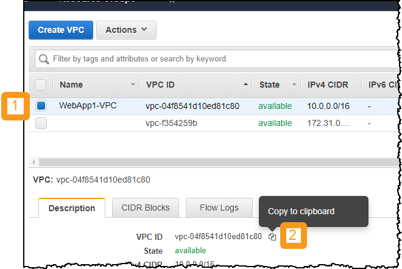
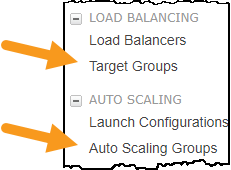
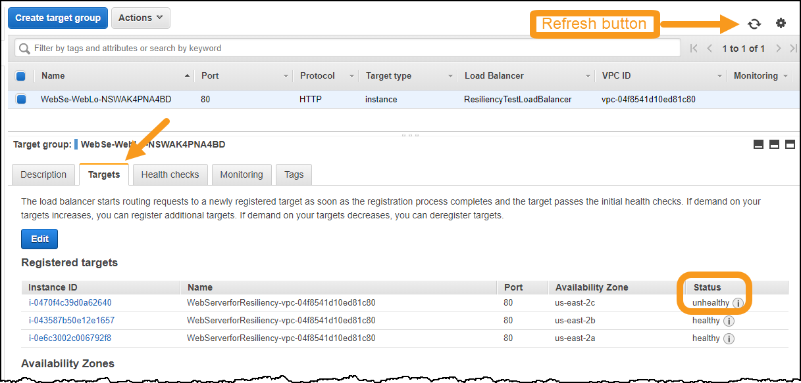
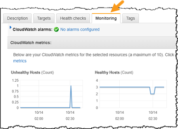
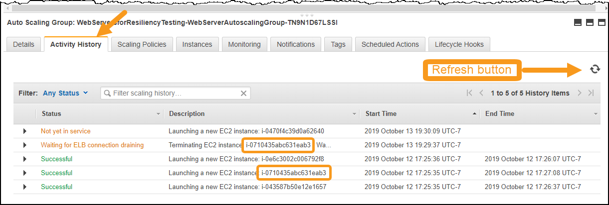

# Level 200: Testing for Resiliency of EC2

## Authors

* Rodney Lester, Reliability Lead, Well-Architected

## Table of Contents

1. [Deploy the Infrastructure](#prerequisite)
2. [Configure Execution Environment](#simple_web_app_failure)
3. [Test Resiliency Using Failure Injection](#failure_injection)
4. [Tear Down](#tear_down)

## 1. Deploy the Infrastructure 

It is a prerequisite to this lab is that you have deployed the static web application stack. If you have _already_ run the following two labs (and have not torn down the resources) then you have already deployed the necessary infrastructure. Proceed to next step **Configure Execution Environment**

* [Security: Level 200: Automated Deployment of VPC](../../Security/200_Automated_Deployment_of_VPC/Lab_Guide.md)
* [Security: Level 200: Automated Deployment of EC2 Web Application](../../Security/200_Automated_Deployment_of_EC2_Web_Application/Lab_Guide.md)

If you _have not_ already deployed the necessary infrastructure, then follow these steps:

### 1.1 Deploy the VPC infrastructure

* If you are comfortable deploying a CloudFormation stack, then use the _express steps_ listed here.
* If you need guidance in how to deploy a CloudFormation stack, then follow the directions for the [Automated Deployment of VPC](../../Security/200_Automated_Deployment_of_VPC/Lab_Guide.md) lab, and then return here for the next step: **1.2 Deploy the EC2s and Static WebApp insfrastructure**

#### Express Steps (Deploy the VPC infrastructure)

1. Download the [vpc-alb-app-db.yaml](https://raw.githubusercontent.com/awslabs/aws-well-architected-labs/master/Security/200_Automated_Deployment_of_VPC/Code/vpc-alb-app-db.yaml) CloudFormation template
1. Choose the AWS region you wish to use - if possible we recommend using **us-east-2 (Ohio)**
1. In your chosen region, create a CloudFormation stack uploading this CloudFormation Template
1. Name the stack _WebApp1-VPC_ (case sensitive)
1. Leave all  CloudFormation Parameters at their default values
1. click **Next** until the last page
1. check **I acknowledge that AWS CloudFormation might create IAM resources with custom names** then click **Create stack**

### 1.2 Deploy the EC2s and Static WebApp insfrastructure

* If you are comfortable deploying a CloudFormation stack, then use the _express steps_ listed here.
* If you need guidance in how to deploy a CloudFormation stack, then follow the directions for the [Automated Deployment of EC2 Web Application](../../Security/200_Automated_Deployment_of_EC2_Web_Application/Lab_Guide.md#create_web_stack)
    * Follow directions for the **create a static web application** option
    * Then return here for the next step: **Website URL**

#### Express Steps (Deploy the EC2s and Static WebApp insfrastructure)

1. Download the [staticwebapp.yaml](https://raw.githubusercontent.com/awslabs/aws-well-architected-labs/master/Security/200_Automated_Deployment_of_EC2_Web_Application/Code/staticwebapp.yaml) CloudFormation template
1. In your chosen region, create a CloudFormation stack uploading this CloudFormation Template
1. Name the stack _WebApp1-Static_ (case sensitive)
1. Leave all  CloudFormation Parameters at their default values
1. click **Next** until the last page
1. check **I acknowledge that AWS CloudFormation might create IAM resources with custom names** then click **Create stack**

#### Website URL

* In the _WebApp1-Static_ stack click the **Outputs** tab, and open the **WebsiteURL** value in your web browser, this is how to access what you just created
* Save this URL - you will need it later

## 2. Configure Execution Environment 

Failure injection is a means of testing resiliency by which a specific failure type is simulated on a service and its response is assessed.

You have a choice of environments from which to execute the failure injections for this lab. Bash scripts are a good choice and can be used from a Linux command line. If you prefer Python, Java, Powershell, or C# instructions for these are also provided.

### 2.1 Setup AWS credentials and configuration 

Your execution environment needs to be configured to enable access to the AWS account you are using for the workshop. This includes

* Credentials
    * AWS access key
    * AWS secret access key
    * AWS session token (used in some cases)

* Configuration
    * Region: us-east-2 (or region where you deployed your WebApp)
    * Default output: JSON

Note: **us-east-2** is the **Ohio** region

* If you already know how to configure these, please do so now and proceed to the next step [**2.2 Set up the bash environment**](#bash)
* If you need help then follow the instructions in either Option A or Option B below

#### Option A AWS CLI

This option uses the AWS CLI. If you do not have this installed, or do not want to install it, then use **Option B**

1. To see if the AWS CLI is installed:

          $ aws --version
          aws-cli/1.16.249 Python/3.6.8...

     * AWS CLI version 1.1 or higher is fine
     * If you instead got `command not found` then either  [install the AWS CLI](Documentation/Software_Install.md#awscli) or use **Option B**

1. Run `aws configure` and provide the following values:

        $ aws configure
        AWS Access Key ID [*************xxxx]: <Your AWS Access Key ID>
        AWS Secret Access Key [**************xxxx]: <Your AWS Secret Access Key>
        Default region name: [us-east-2]: us-east-2 (or your chosen region)
        Default output format [None]: json

#### Option B Manually creating credential files

If you already did **Option A**, then skip this

1. create a `.aws` directory under your home directory

        mkdir ~/.aws

1. Change directory to there

        cd ~/.aws

1. Use a text editor (vim, emacs, notepad) to create a text file (no extension) named `credentials`. In this file you should have the following text.  

        [default]
        aws_access_key_id = <Your access key>
        aws_secret_access_key = <Your secret key>

1. Create a text file (no extension) named `config`. In this file you should have the following text:

        [default]
        region = us-east-2 (or your chosen region)
        output = json

### 2.2 Set up the bash environment 

Using bash is an effective way to execute the failure injection tests for this workshop. The bash scripts make use of the AWS CLI. If you will be using bash, then follow the directions in this section. If you cannot use bash, then [skip to the next section](#notbash).

1. Prerequisites

     * `awscli` AWS CLI installed

            $ aws --version
            aws-cli/1.16.249 Python/3.6.8...
         * Version 1.1 or higher is fine
         * If you instead got `command not found` then [see instructions here to install `awscli`](Documentation/Software_Install.md#awscli)

     * `jq` command-line JSON processor installed.

            $ jq --version
            jq-1.5-1-a5b5cbe
         * Version 1.4 or higher is fine
         * If you instead got `command not found` then [see instructions here to install `jq`](Documentation/Software_Install.md#jq)

1. Download the **fail_instance.sh** script from [the resiliency bash scripts on GitHub](https://github.com/awslabs/aws-well-architected-labs/tree/master/Reliability/300_Testing_for_Resiliency_of_EC2_RDS_and_S3/Code/FailureSimulations/bash) to a location convenient for you to execute it. You can use the following link to download the script:
      * [bash/fail_instance.sh](https://raw.githubusercontent.com/awslabs/aws-well-architected-labs/master/Reliability/300_Testing_for_Resiliency_of_EC2_RDS_and_S3/Code/FailureSimulations/bash/fail_instance.sh)

1. Set the script to be executable.  

        chmod u+x fail_instance.sh

### 2.3 Set up the programming language environment (for Python, Java, C#, or PowerShell) 

If you will be using bash and executed the the steps in the _previous_ section, then you can [skip this and go to the section: **Test Resiliency Using Failure Injection**](#failure_injection)

* If you will be using Python, Java, C#, or PowerShell for this workshop, [click here for instructions on setting up your environment](Documentation/Programming_Environment.md)

## 3. Test Resiliency Using Failure Injection 

**Failure injection** (also known as **chaos testing**) is an effective and essential method to validate and understand the resiliency of your workload and is a recommended practice of the [AWS Well-Architected Reliability Pillar](https://aws.amazon.com/architecture/well-architected/). Here you will initiate various failure scenarios and assess how your system reacts.

### Preparation

Before testing, please prepare the following:

1. Region must be the one you selected when you deployed your WebApp
      * We will be using the AWS Console to assess the impact of our testing
      * Throughout this lab, make sure you are in the correct region. For example the following screen shot shows the desired region assuming your WebApp was deployed to **Ohio** region

        

1. Get VPC ID
      * A VPC (Amazon Virtual Private Cloud) is a a logically isolated section of the AWS Cloud where you have deployed the resources for your service
      * For these tests you will need to know the **VPC ID** of the VPC you created as part of deploying the service
      * Navigate to the VPC management console: <https://console.aws.amazon.com/vpc>
      * In the left pane, click **Your VPCs**
      * 1 - Tick the checkbox next to **WebApp1-VPC**
      * 2 - Copy the **VPC ID**

    

     * Save the VPC ID - you will use later whenever `<vpc-id>` is indicated in a command

1. Get familiar with the service website
      1. Point a web browser at the URL you saved from earlier
            * If you do not recall this, then in the _WebApp1-Static_ stack click the **Outputs** tab, and open the **WebsiteURL** value in your web browser, this is how to access what you just created)
      1. Note the **instance_id** (begins with **i-**) - this is the EC2 instance serving this request
      1. Refresh the website several times watching these values
      1. Note the values change. You have deployed two web servers per each of three Availability Zones.
         * The AWS Elastic Load Balancer (ELB) sends your request to any of these three healthy instances.

### 3.1 EC2 failure injection

This failure injection will simulate a critical problem with one of the three web servers used by your service.

1. Navigate to the EC2 console at <http://console.aws.amazon.com/ec2> and click **Instances** in the left pane.

1. There are three EC2 instances with a name beginning with **WebApp1**. For these EC2 instances note:
      1. Each has a unique *Instance ID*
      1. There is two instances per each Availability Zone
      1. All instances are healthy

    

1. Open up two more console in separate tabs/windows. From the left pane, open **Target Groups** and **Auto Scaling Groups** in separate tabs. You now have three console views open

    

1. To fail one of the EC2 instances, use the VPC ID as the command line argument replacing `<vpc-id>` in _one_ (and only one) of the scripts/programs below. (choose the language that you setup your environment for)

    | Language   | Command                                         |
    | :--------- | :---------------------------------------------- |
    | Bash       | `./fail_instance.sh <vpc-id>`                   |
    | Python     | `python fail_instance.py <vpc-id>`              |
    | Java       | `java -jar app-resiliency-1.0.jar EC2 <vpc-id>` |
    | C#         | `.\AppResiliency EC2 <vpc-id>`                  |
    | PowerShell | `.\fail_instance.ps1 <vpc-id>`                  |

1. The specific output will vary based on the command used, but will include a reference to the ID of the EC2 instance and an indicator of success.  Here is the output for the Bash command. Note the `CurrentState` is `shutting-down`

        $ ./fail_instance.sh vpc-04f8541d10ed81c80
        Terminating i-0710435abc631eab3
        {
            "TerminatingInstances": [
                {
                    "CurrentState": {
                        "Code": 32,
                        "Name": "shutting-down"
                    },
                    "InstanceId": "i-0710435abc631eab3",
                    "PreviousState": {
                        "Code": 16,
                        "Name": "running"
                    }
                }
            ]
        }

1. Go to the *EC2 Instances* console which you already have open (or [click here to open a new one](http://console.aws.amazon.com/ec2/v2/home?#Instances:))

      * Refresh it. (_Note_: it is usually more efficient to use the refresh button in the console, than to refresh the browser)
       
      * Observe the status of the instance reported by the script. In the screen cap below it is _shutting down_ as reported by the script and will ultimately transition to _terminated_.

        

### 3.2 System response to EC2 instance failure

Watch how the service responds. Note how AWS systems help maintain service availability. Test if there is any non-availability, and if so then how long.

#### 3.2.1 System availability

Refresh the service website several times. Note the following:

* Website remains available
* The remaining two EC2 instances are handling all the requests (as per the displayed instance_id)

#### 3.2.2 Load balancing

Load balancing ensures service requests are not routed to unhealthy resources, such as the failed EC2 instance.

1. Go to the **Target Groups** console you already have open (or [click here to open a new one](http://console.aws.amazon.com/ec2/v2/home?#TargetGroups:))
     * If there is more than one target group, select the one with whose name begins with  **WebAp**

1. Click on the **Targets** tab and observe:
      * Status of the instances in the group. The load balancer will only send traffic to healthy instances.
      * When the auto scaling launches a new instance, it is automatically added to the load balancer target group.
      * In the screen cap below the _unhealthy_ instance is the newly added one.  The load balancer will not send traffic to it until it is completed initializing. It will ultimately transition to _healthy_ and then start receiving traffic.
      * Note the new instance was started in the same Availability Zone as the failed one. Amazon EC2 Auto Scaling automatically maintains balance across all of the Availability Zones that you specify.

          

1. From the same console, now click on the **Monitoring** tab and view metrics such as **Unhealthy hosts** and **Healthy hosts**

   

#### 3.2.3 Auto scaling

Autos scaling ensures we have the capacity necessary to meet customer demand. The auto scaling for this service is a simple configuration that ensures at least three EC2 instances are running. More complex configurations in response to CPU or network load are also possible using AWS.

1. Go to the **Auto Scaling Groups** console you already have open (or [click here to open a new one](http://console.aws.amazon.com/ec2/autoscaling/home?#AutoScalingGroups:))
      * If there is more than one auto scaling group, select the one with the name that starts with **WebApp1**

1. Click on the **Activity History** tab and observe:
      * The screen cap below shows that instances were successfully started at 17:25
      * At 19:29 the instance targeted by the script was put in _draining_ state and a new instance ending in _...62640_ was started, but was still initializing. The new instance will ultimately transition to _Successful_ status

          

_Draining_ allows existing, in-flight requests made to an instance to complete, but it will not send any new requests to the instance. *__Learn more__: After the lab [see this blog post](https://aws.amazon.com/blogs/aws/elb-connection-draining-remove-instances-from-service-with-care/) for more information on _draining_.*

*__Learn more__: After the lab see [Auto Scaling Groups](https://docs.aws.amazon.com/autoscaling/ec2/userguide/AutoScalingGroup.html) to learn more how auto scaling groups are setup and how they distribute instances, and [Dynamic Scaling for Amazon EC2 Auto Scaling](https://docs.aws.amazon.com/autoscaling/ec2/userguide/as-scale-based-on-demand.html) for more details on setting up auto scaling that responds to demand*

#### 3.2.4 EC2 failure injection - conclusion

Deploying multiple servers and Elastic Load Balancing enables a service suffer the loss of a server with no availability disruptions as user traffic is automatically routed to the healthy servers. Amazon Auto Scaling ensures unhealthy hosts are removed and replaced with healthy ones to maintain high availability.

| |
|:---:|
|**Availability Zones** (**AZ**s) are isolated sets of resources within a region, each with redundant power, networking, and connectivity, housed in separate facilities. Each Availability Zone is isolated, but the Availability Zones in a Region are connected through low-latency links. AWS provides you with the flexibility to place instances and store data across multiple Availability Zones within each AWS Region for high resiliency.|
|*__Learn more__: After the lab [see this whitepaper](https://docs.aws.amazon.com/whitepapers/latest/aws-overview/global-infrastructure.html) on regions and availability zones*|

***

## 4. Tear down this lab 

The following instructions will remove the resources that you have created in this lab.

If you deployed the CloudFormation stacks as part of the prerequisites for this lab, then delete these stacks to remove all the AWS resources. If you need help with how to delete CloudFormation stacks then follow these instructions to tear down those resources:

* [Delete the WebbApp resources](https://github.com/awslabs/aws-well-architected-labs/blob/master/Security/200_Automated_Deployment_of_EC2_Web_Application/Lab_Guide.md#tear_down)
* Wait for this stack deletion to complete
* [Delete the VPC resources](https://github.com/awslabs/aws-well-architected-labs/blob/master/Security/200_Automated_Deployment_of_VPC/Lab_Guide.md#tear_down)

Otherwise, there were no additional new resources added as part of this lab.

***

## References & useful resources

[AWS CloudFormation User Guide](https://docs.aws.amazon.com/AWSCloudFormation/latest/UserGuide/Welcome.html)  
[Amazon EC2 User Guide for Linux Instances](https://docs.aws.amazon.com/AWSEC2/latest/UserGuide/concepts.html)

***

## License

Licensed under the Apache 2.0 and MITnoAttr License.

Copyright 2019 Amazon.com, Inc. or its affiliates. All Rights Reserved.

Licensed under the Apache License, Version 2.0 (the "License"). You may not use this file except in compliance with the License. A copy of the License is located at

    https://aws.amazon.com/apache2.0/

or in the "license" file accompanying this file. This file is distributed on an "AS IS" BASIS, WITHOUT WARRANTIES OR CONDITIONS OF ANY KIND, either express or implied. See the License for the specific language governing permissions and limitations under the License.
