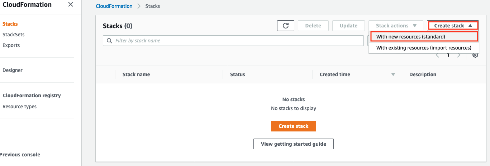
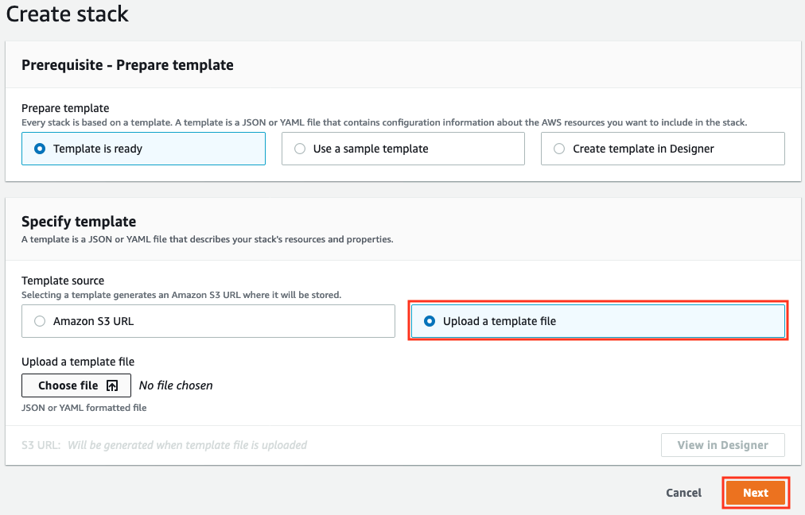

# Level 200: Automated Deployment of VPC

## Authors

- Ben Potter, Security Lead, Well-Architected

## Table of Contents

1. [Overview](#overview)
2. [Create VPC Stack](#create_vpc_stack)
3. [Knowledge Check](#knowledge_check)
4. [Tear Down](#tear_down)

## 1. Overview 

## 2. Create VPC Stack 

This step will create the VPC and all components using the example CloudFormation template.

1. Download the latest version of the [vpc-alb-app-db.yaml](https://raw.githubusercontent.com/awslabs/aws-well-architected-labs/master/Security/200_Automated_Deployment_of_VPC/Code/vpc-alb-app-db.yaml) CloudFormation template from file from GitHub raw, or by [cloning](https://help.github.com/en/articles/cloning-a-repository) this repository.
2. Sign in to the AWS Management Console, select your preferred region, and open the CloudFormation console at [https://console.aws.amazon.com/cloudformation/](https://console.aws.amazon.com/cloudformation/). Note if your CloudFormation console does not look the same, you can enable the redesigned console by clicking **New Console** in the **CloudFormation** menu.
3. Click **Create Stack**, then **With new resources (standard)**.

4. Click **Upload a template file** and then click **Choose file**.

5. Choose the CloudFormation template you downloaded in step 1, return to the CloudFormation console page and click **Next**.
6. Enter the following details:
  * Stack name: The name of this stack. For this lab, use *WebApp1-VPC* and match the case.
  The parameters may be left as defaults, you can find out more in the description for each. If you change the default name take note as you will need to use it for other labs including "Automated Deployment of EC2 Web Application".

7. At the bottom of the page click **Next**.
8. In this lab, we won't add any tags, permissions or advanced options. Click **Next**. Tags, which are key-value pairs, can help you identify your stacks. For more information, see [Adding Tags to Your AWS CloudFormation Stack](https://docs.aws.amazon.com/AWSCloudFormation/latest/UserGuide//cfn-console-add-tags.html).
9. Review the information for the stack. When you're satisfied with the configuration, check **I acknowledge that AWS CloudFormation might create IAM resources with custom names** then click **Create stack**.

10. After a few minutes the final stack status should change from *CREATE_IN_PROGRESS* to *CREATE_COMPLETE*.
You have now created the VPC stack (well actually CloudFormation did it for you).
11. Now you have a new VPC, check out [200_Automated_Deployment_of_EC2_Web_Application](../200_Automated_Deployment_of_EC2_Web_Application/README.md) to deploy a web application inside it.

## 3. Knowledge Check 

The security best practices followed in this lab are: 

* [Grant least privileges:](https://wa.aws.amazon.com/wat.question.SEC_3.en.html) The roles are scoped with minimum privileges to accomplish the task.
* [Implement new security services and features:](https://wa.aws.amazon.com/wat.question.SEC_5.en.html) New features including secrets manager have been adopted.
* [Limit exposure:](https://wa.aws.amazon.com/wat.question.SEC_6.en.html) Security groups restrict network traffic to a minimum. Use of Internet Gateways and NAT Gateways in use to control traffic flows.
* [Automate configuration management:](https://wa.aws.amazon.com/wat.question.SEC_6.en.html) CloudFormation is being used to deploy the networking constructs.
* [Control traffic at all layers:](https://wa.aws.amazon.com/wat.question.SEC_6.en.html) Traffic is controlled in multiple tiers, using subnets with different route tables.

***

### 4. Tear down this lab 

The following instructions will remove the resources that you have created in this lab.

Note: If you are planning on completing the lab [200_Automated_Deployment_of_EC2_Web_Application](../200_Automated_Deployment_of_EC2_Web_Application/README.md) we recommend you only tear down this lab after completing both, as there is a dependency on this VPC.

Delete the VPC CloudFormation stack:

1. Sign in to the AWS Management Console, select your preferred region, and open the CloudFormation console at [https://console.aws.amazon.com/cloudformation/](https://console.aws.amazon.com/cloudformation/).
2. Click the radio button on the left of the *WebApp1-VPC* stack.
3. Click the **Actions** button then click **Delete stack**.
4. Confirm the stack and then click **Delete** button.

Delete the CloudWatch Logs:

1. Sign in to the AWS Management Console, select your preferred region, and open the CloudFormation console at [https://console.aws.amazon.com/cloudwatch/](https://console.aws.amazon.com/cloudwatch/).
2. Click **Logs** in the left navigation.
3. Click the radio button on the left of the **WebApp1-VPC-VPCFlowLogGroup-\<some unique ID\>**.
4. Click the **Actions Button** then click **Delete Log Group**.
5. Verify the log group name then click **Yes, Delete**.

***

## References & useful resources

[AWS CloudFormation User Guide](https://docs.aws.amazon.com/AWSCloudFormation/latest/UserGuide/Welcome.html)
[Amazon VPC User Guide](https://docs.aws.amazon.com/vpc/latest/userguide/what-is-amazon-vpc.html)

***

## License

Licensed under the Apache 2.0 and MITnoAttr License.

Copyright 2019-2020 Amazon.com, Inc. or its affiliates. All Rights Reserved.

Licensed under the Apache License, Version 2.0 (the "License"). You may not use this file except in compliance with the License. A copy of the License is located at

    https://aws.amazon.com/apache2.0/

or in the "license" file accompanying this file. This file is distributed on an "AS IS" BASIS, WITHOUT WARRANTIES OR CONDITIONS OF ANY KIND, either express or implied. See the License for the specific language governing permissions and limitations under the License.
